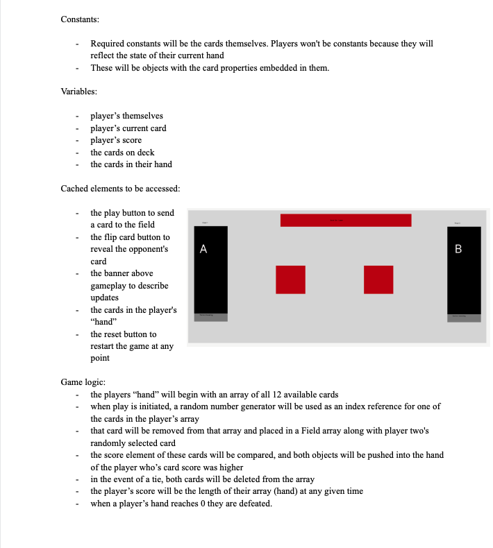
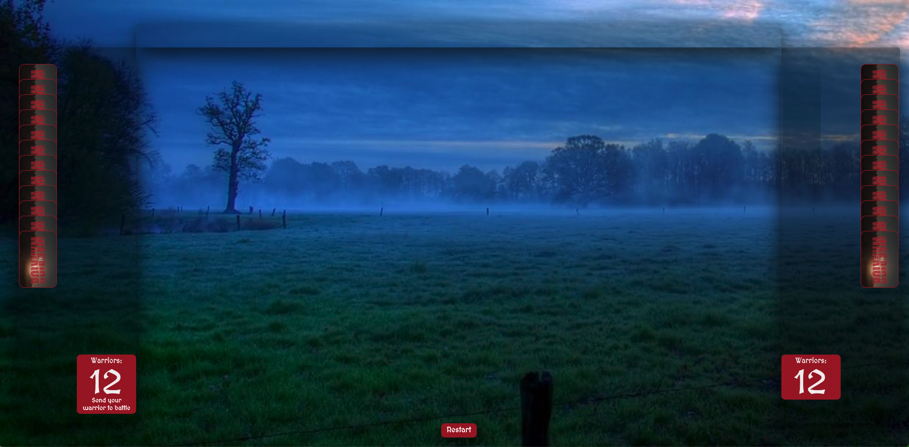
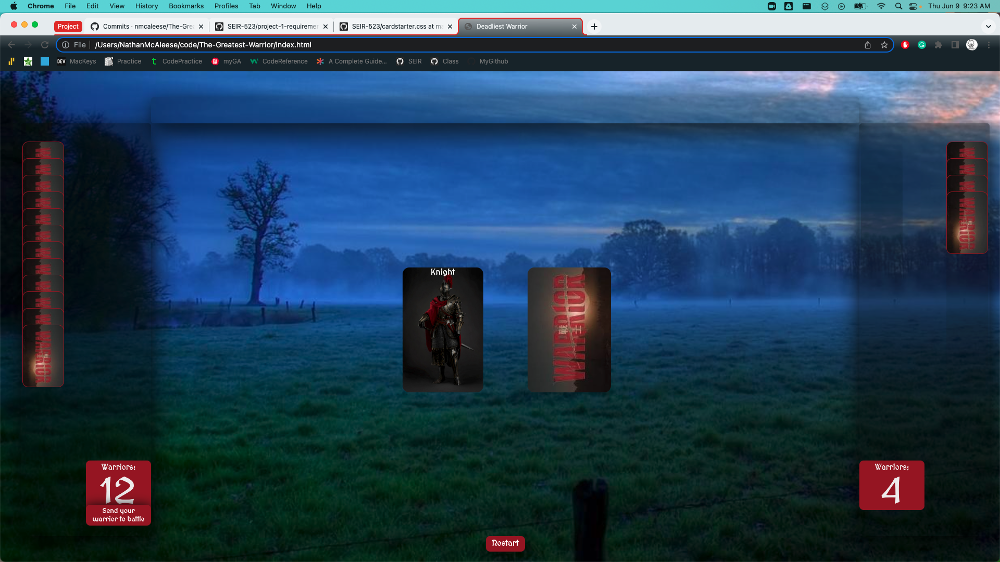
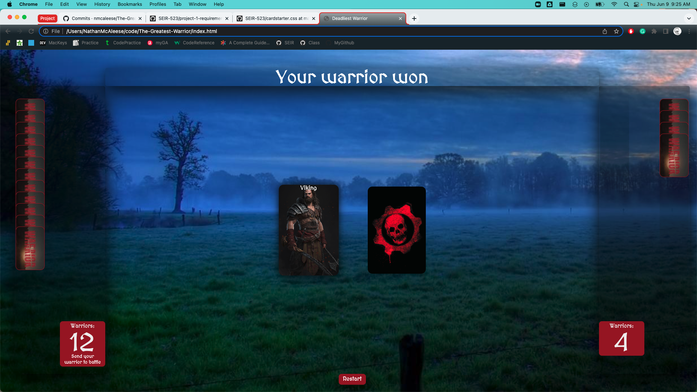
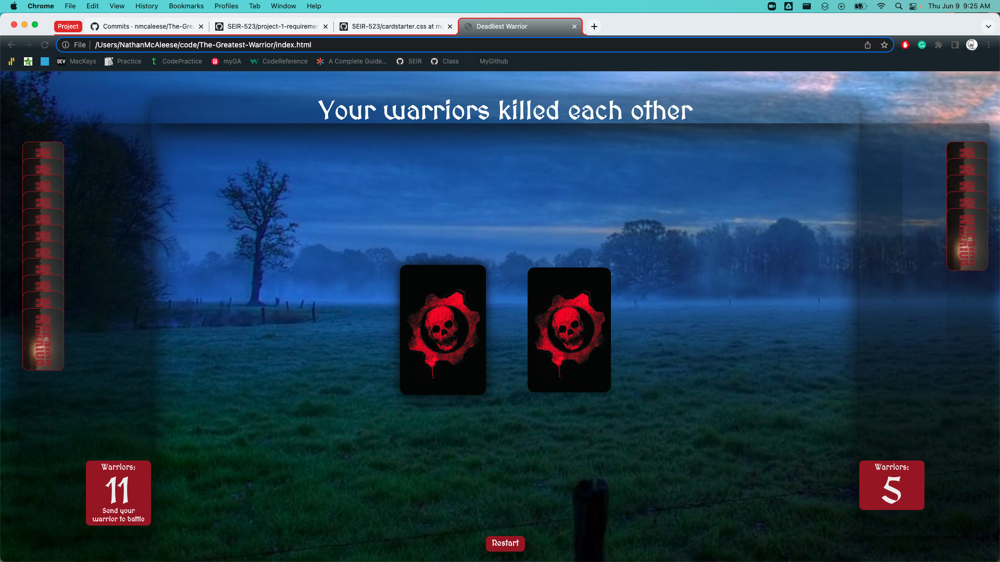

# Deadliest-Warrior

The classic card game War... With a twist. Player's decks are not composed of standardized 2-A cards, but of the greatest warriors throughout history. Random warrior cards from a player's hand are pitted againt the computer's warrior card and the winner leaves with the captive added to their growing army(deck). Last army standing wins!!!

# Screenshots

# Technologies Used:

JavaScript, HTML, CSS

# Getting Started:

https://nmcaleese.github.io/The-Greatest-Warrior/
# Next Steps:

ICE BOX:

- Adding in a tie function that adds more cards to the cardsOnField array and then to the players hand upon victory
- Adding additional warrior cards
- Develop more intricate win/lose criteria to better represent different warrior's strengths/weaknesses
